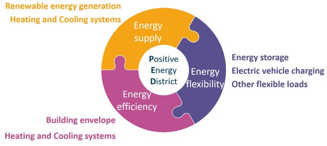

# Positive Energy Districts

A Positive Energy District is an urban area that produces more renewable energy than it consumes over the course of a year, while also ensuring resilience, affordability, and environmental sustainability. PEDs are not just about individual buildings; they integrate renewable energy generation, energy storage, and highly efficient building systems into a coordinated network that supports both people and the grid. The image developed by Bruck, et al. (2022)

<figure>

<figcaption >Main pillars of PEDs</figcaption>
</figure>

## Renewable Energy Generation

This pillar focuses on producing clean energy locally within the district. Instead of relying solely on fossil-fuel-based grids, PEDs use a mix of renewable technologies to cover their energy needs and feed surplus power back into the system.
In a PED, much of the energy comes from solar panels integrated into rooftops and façades. Some districts also use geothermal wells that tap into underground heat to supply both electricity and heating. These local systems allow the district to cover most of its own energy demand.

#### Examples of such an infrastructre include:

-   Rooftop and façade-integrated solar photovoltaics (PV).
-   Small-scale wind turbines in suitable urban zones.
-   Geothermal systems for electricity and heating.
-   Shared district-level renewable plants (solar farms, biomass CHP).

These renewable sources are often distributed, meaning energy is generated close to where it is consumed, reducing transmission losses and increasing energy autonomy.

## Energy Storage

Since renewable energy generation can be variable (sunlight, wind), storage ensures reliability and flexibility. By storing excess energy, PEDs can balance supply and demand across daily and seasonal cycles. Since renewable energy generation can be variable (sunlight, wind), storage ensures reliability and flexibility. By storing excess energy, PEDs can balance supply and demand across daily and seasonal cycles.

#### Examples of such an infrastructre include:

-   Battery systems (lithium-ion or next-generation chemistries) for short-term storage and grid balancing.
-   Thermal storage such as hot water tanks or phase-change materials to capture excess heat for later use.
-   Hydrogen production (via electrolysis) for long-term storage and mobility applications.
-   Energy storage enables PEDs to operate as prosumers (producers + consumers), making them more resilient during peak demand or grid disruptions.

Energy storage enables PEDs to operate as prosumers (producers + consumers), making them more resilient during peak demand or grid disruptions.

## Building Envelope Efficiency and Heating & Cooling Systems

The third pillar focuses on reducing demand before generating energy. By improving the efficiency of buildings, less energy is needed overall, making it easier for the district to reach a positive balance. The third pillar focuses on reducing demand before generating energy. By improving the efficiency of buildings, less energy is needed overall, making it easier for the district to reach a positive balance. Energy demand is kept low by designing buildings with well-insulated walls and triple-glazed windows that keep indoor temperatures stable. For heating and cooling, many PEDs use electric heat pumps that run on renewable electricity, moving heat in and out of buildings efficiently across the seasons.

#### Examples of such an infrastructre include:

-   High-performance building envelopes (insulation, airtightness, triple glazing, reflective or green roofs).
-   Passive design strategies (natural ventilation, daylight optimization, shading).
-   Efficient heating and cooling systems such as district heating with renewable sources, heat pumps, and waste heat recovery.
-   Smart building management systems that optimize energy use dynamically.

This reduces both operational costs and environmental impact, while also improving comfort and health for occupants.

### The Integrated System: How the Three Pillars Work Together

These three areas are not standalone; their interaction is what makes a Positive Energy District successful:
\* Efficient buildings reduce demand, so renewable systems don't need to be oversized.
\* Local renewable generation supplies most of the reduced demand, while excess production can be stored or shared.
\* Energy storage balances fluctuations, ensuring that renewable energy can be used even when generation is low.

For example, an office building with solar façades and a high-performance envelope might produce more power than it consumes on a summer day. The surplus can be stored in batteries or converted into heat for a district thermal network, which in turn supplies nearby residential units in winter.

The result is a resilient, low-carbon energy ecosystem, where buildings and districts support each other, communities benefit from affordable and clean energy, and cities move closer to climate neutrality.

# Data Exploration

Now let's look at some data to start understanidng better life.

---
#### References
Bruck, Axel, Luca Casamassima, Ardak Akhatova, Lukas Kranzl, and Kostas Galanakis. 2022. "Creating Comparability Among European Neighbourhoods to Enable the Transition of District Energy Infrastructures Towards Positive Energy Districts." *Energies* 15 (13). <https://doi.org/10.3390/en15134720>.

