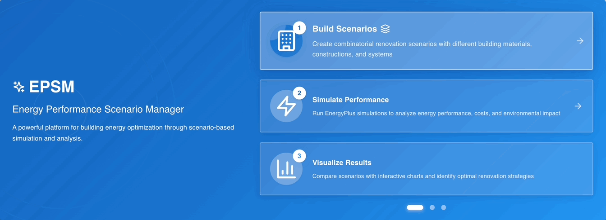
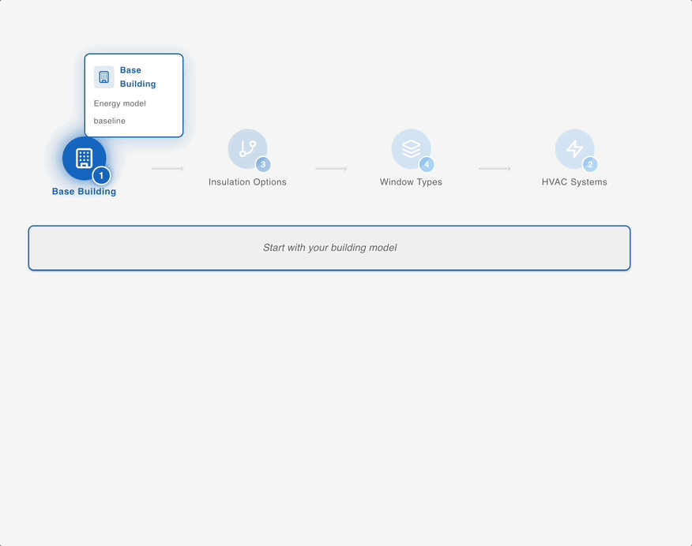
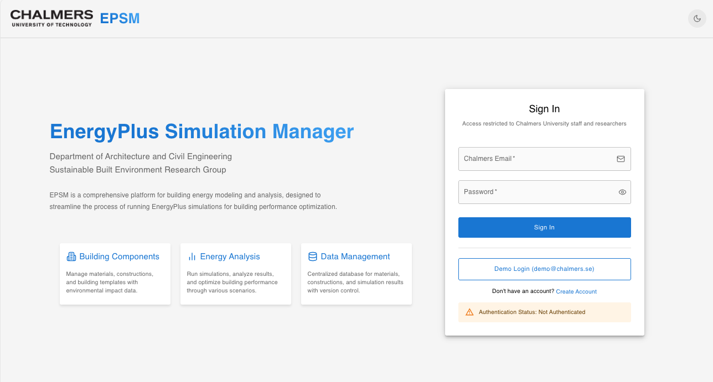
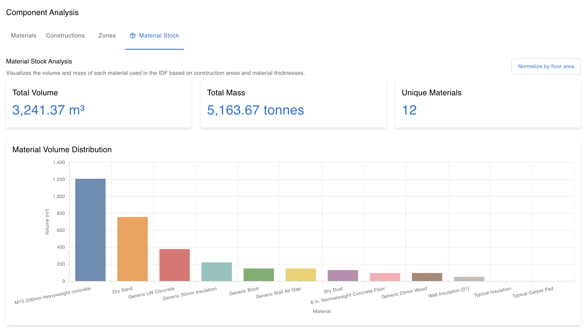
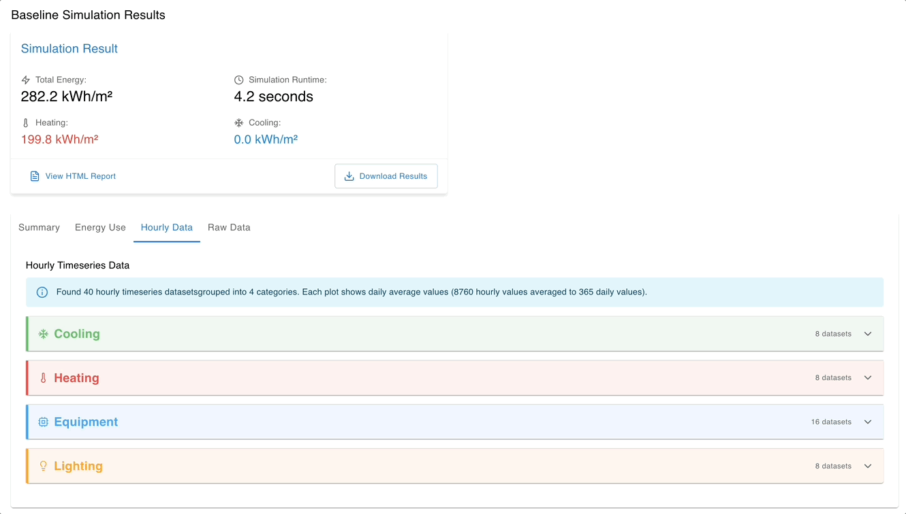

## The Challenge

Researchers at Chalmers University of Technology needed to analyse energy performance across large building portfolios—but existing tools weren't designed for portfolio-scale research, often leading researchers to rebuild entire pipelines project-by-project. Running hundreds of building energy simulations, managing complex retrofit scenarios, and analysing results across multiple buildings required tedious manual work that consumed valuable research time.

They needed a platform that could make sophisticated building energy modelling more accessible, enabling researchers to focus on insights rather than simulation management.

## Our Solution

NODAL partnered with Chalmers University to design and develop the **Energy Performance Simulation Manager (EPSM)**—a custom web-based platform that supports researchers conducting large-scale building energy studies. We built EPSM to reduce technical barriers and make certain types of research more practical.

## What We Built

We created an end-to-end simulation workflow that empowers researchers to:

1. **Build Comprehensive Material Libraries** - Centralise thermal properties, optical characteristics, and embodied carbon data for consistent analysis
2. **Establish Baseline Performance** - Rapidly process EnergyPlus IDF files to create initial building models
3. **Design Retrofit Scenarios** - Systematically explore different improvement strategies with controlled variables
4. **Execute at Scale** - Run hundreds of simulations in parallel using containerised processing
5. **Analyse & Compare** - Visualise results across multiple buildings and scenarios to identify patterns and opportunities

## Capabilities We Delivered

### Portfolio-Scale Geographic Analysis
We developed geographic integration capabilities that allow researchers to select any region in Sweden and analyse entire building portfolios. This spatial approach supports urban-scale energy studies.

### Automated Model Generation
Our automated model generation pipeline extracts building geometry, materials, and construction details from EnergyPlus IDF files—reducing hours of manual work to minutes. Researchers can establish baselines for hundreds of buildings more efficiently.

### Material Stock Assessment
We implemented comprehensive material inventory tracking that connects thermal properties with embodied carbon data. This enables researchers to study both operational energy and sustainability impacts—useful for holistic building assessment research.

### Interactive Results Analysis
Our visualisation framework lets researchers explore simulation outputs through interactive charts and detailed breakdowns. Comparing baseline performance against multiple retrofit scenarios reveals optimisation opportunities and validates research hypotheses.

## Technical Innovation

We architected EPSM as a robust, scalable platform that handles the complexity of large-scale simulation studies:

- **Centralized Material Database**: Built a comprehensive materials management system that ensures consistency across thousands of simulations
- **Template-Based Construction Sets**: Designed reusable construction assemblies that accelerate scenario development
- **Parallel Processing Engine**: Implemented Celery-based batch processing that executes multiple simulations simultaneously
- **Flexible Export Options**: Created reporting tools that generate both CSV data for analysis and PDF reports for stakeholders
- **Institutional Integration**: Seamlessly integrated with Chalmers' authentication system for secure, authorised access
- **Containerised Architecture**: Deployed EnergyPlus simulations in Docker containers, ensuring reliability and enabling horizontal scaling

## Research Impact

EPSM helps Chalmers researchers conduct studies more efficiently:

- **Urban Energy Planning**: Analyse building portfolios at city and regional scales to inform policy decisions
- **Retrofit Optimisation**: Systematically evaluate improvement strategies across diverse building types
- **Parametric Research**: Conduct large-scale parametric studies on envelope and system configurations
- **Circular Economy Studies**: Connect operational energy with embodied carbon for comprehensive sustainability assessment
- **Evidence-Based Policy**: Generate quantitative performance data that supports climate action initiatives

## Supporting Open Research

We designed EPSM with an intuitive workflow that reduces barriers to sophisticated energy modelling. The platform includes comprehensive documentation covering setup, development, API integration, and deployment—enabling other institutions to benefit from this research tool.

---

**Our Approach**: Custom Research Platform Development  
**Technology Stack**: Django • PostgreSQL • Celery • Docker • EnergyPlus • Redis  
**Project Status**: Active Development | Open Source  

**Interested in supporting research at your institution?** Contact us to discuss how NODAL can develop custom platforms that support your research goals.
