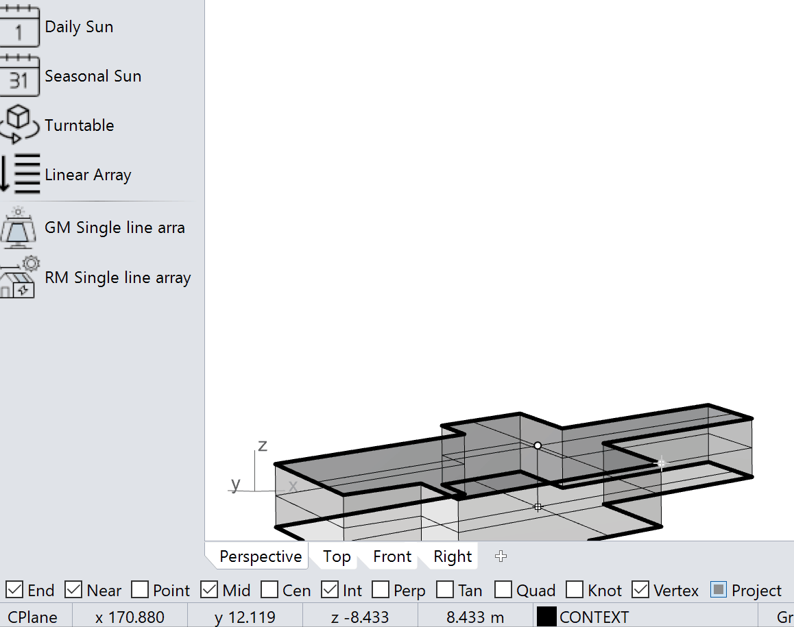

## The Challenge

Designing **Solar Car Parks (SCPs)**, **rooftop PV systems**, and **ground-mounted solar plants** is a complex, multidisciplinary task that spans architecture, engineering, energy modeling, and financial feasibility.

3ti Energy Hubs needed a faster and more accessible way to **design and evaluate solar installations**—one that could be used by both technical and non-technical staff. Existing PV design workflows were fragmented, requiring multiple software tools, manual data transfers, and repetitive modelling work.

They needed a solution that could unify **parametric geometry creation**, **solar performance analysis**, and **financial modelling**—reducing project turnaround time while maintaining engineering accuracy.

---

## Our Solution

NODAL partnered with 3ti Energy Hubs to design and develop the **Parametric Design Tool (PDT)**—a Rhino-based solar design system that integrates **3D modelling**, **solar simulation**, and **financial evaluation** into one seamless workflow.

We built PDT to leverage Rhino3D's geometry engine and Grasshopper's visual programming, allowing users to intuitively draw, parameterise, and simulate PV systems in 3D—without destructive editing or manual recalculation.

---

## What We Built

We created a **multi-phase platform** combining design, analysis, and visualisation workflows:

1. **Parametric Solar Design** - Automatic generation of simplified 3D CAD structures for solar car parks, roof mounts, and ground-mounted arrays

2. **Visualisation Pipeline** - Export of high-quality 3D visualisations to Google Earth and Unreal Engine, enabling stakeholders to explore sites in real context

3. **Energy & Financial Modelling** - Integration of PV simulations, EV charging, energy storage, and cost evaluation for complete project viability analysis

---

## Capabilities We Delivered

### Parametric Geometry Engine
We built PDT as a **Rhino3D add-on** that enables non-destructive modelling of carports and PV layouts. Users can adjust structure dimensions, orientations, and spacing while maintaining a dynamic link to performance metrics.

### Solar & Performance Analysis
Our implementation uses the **PVGIS API** to access accurate solar radiation data and automatically compute:
- Installed capacity and panel count
- Monthly and annual energy yield
- Performance factor (PF) and capacity utilisation factor (CUF)
- Shading effects and array performance differentials

### Automated KPI & Cost Reports
We developed a reporting system where each project produces a **customised summary report** containing key indicators and financial metrics:
- Installed capacity (kWp)
- Normalised project cost (£/kWp)
- System cost breakdown by component (foundation, rafter, gutter, panels, etc.)
- Specific production and yield forecasts

### Seamless Client Presentation
Our **Google Earth export capability** transforms how solar projects are presented. Engineers and sales teams can send clients an interactive `.kmz` file that includes:
- 3D site geometry
- PV system layout
- Key performance metrics

### Immersive Visualisation with PDT Viewer
We also developed the **PDT Viewer**, a real-time Unreal Engine companion app that allows users to explore solar installations under dynamic lighting and weather conditions—with realistic materials, parked cars, and environmental context.

## Visualisation & Communication

### Seamless Client Presentation
PDT’s ability to **export complete 3D sites to Google Earth** transforms how solar projects are presented. Engineers and sales teams can send clients an interactive `.kmz` file that includes:
- 3D site geometry  
- PV system layout  
- Key performance metrics  

### Immersive Visualisation with PDT Viewer
NODAL also developed the **PDT Viewer**, a real-time Unreal Engine companion app that allows users to explore solar installations under dynamic lighting and weather conditions—with realistic materials, parked cars, and environmental context.

---

## Technical Innovation

We architected PDT as a robust, scalable platform that handles the complexity of solar design workflows:

- **Integrated Environment**: Rhino + Python + Grasshopper add-on architecture
- **Data-Driven Design**: Central configuration and validation via `PDT_config.json`
- **PVGIS Integration**: Automated access to weather and solar radiation data
- **Performance Indicators**: Real-time calculation of system yield, PF, CUF, and SP
- **Modular Framework**: Ready for integration with EV charging, storage, and finance models
- **Custom Exports**: Direct KMZ (Google Earth) and Unreal Engine 3D scene generation

## Project Impact

PDT helps 3ti Energy Hubs accelerate solar project delivery:

- **Rapid Design Cycles**: Reduced PV design turnaround from **days to hours**
- **Unified Workflows**: Integrated **technical, design, and sales workflows** under one tool
- **Data-Backed Decisions**: Enabled evidence-based decision making at early project stages
- **Analytical Clarity**: Empowered teams with both **analytical accuracy** and **visual clarity**
- **Scalable Foundation**: Provided a platform later expanded by **EGG Energy** after acquisition

---

**Our Approach**: Parametric Design & Solar Simulation Platform  
**Technology Stack**: Rhino • Python • Grasshopper • Unreal Engine • PVGIS API • Google Earth  
**Project Status**: Acquired by EGG Energy | In Active Use  

**Interested in accelerating solar design or developing your own simulation tool?** Contact NODAL to explore how we can build custom software that bridges design and performance.
