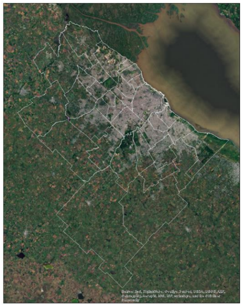
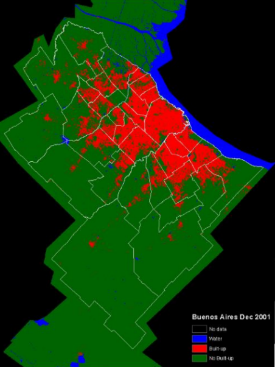
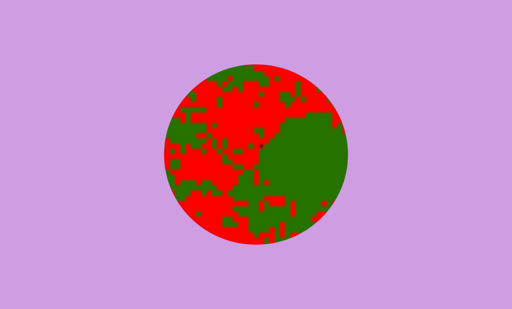
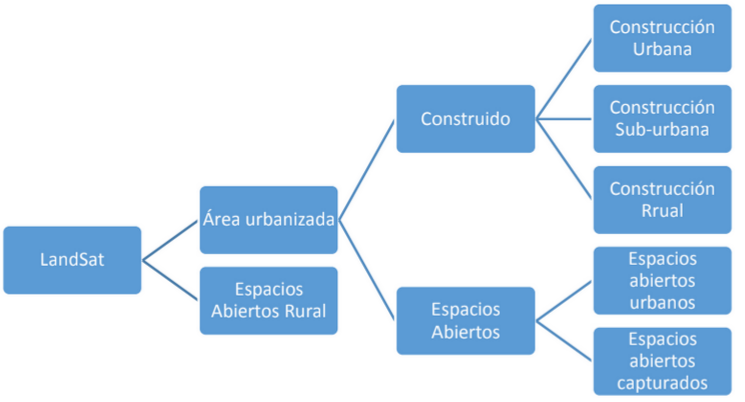
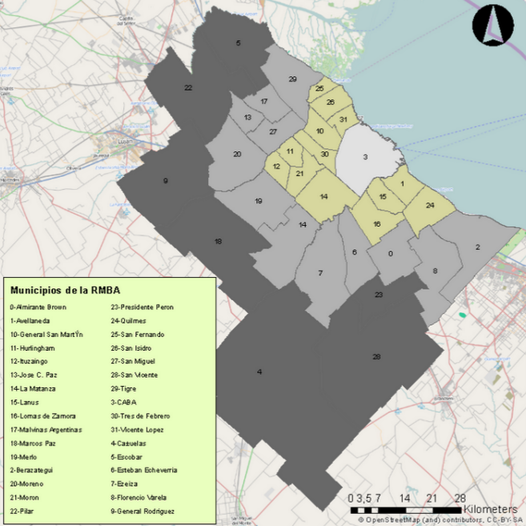
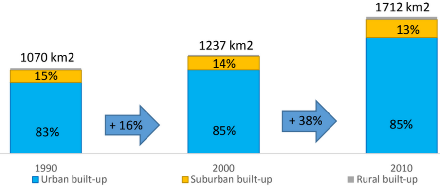
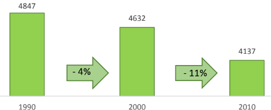
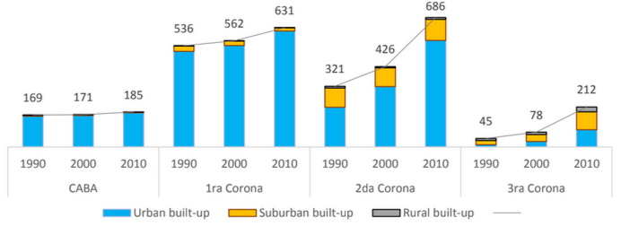
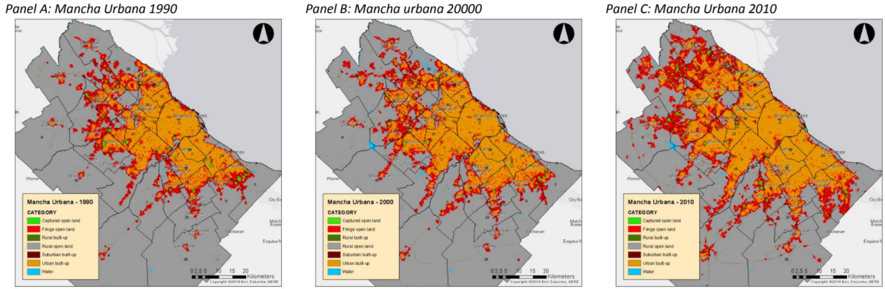

## The Challenge

Understanding urban growth patterns is fundamental for sustainable metropolitan development, yet traditional analysis methods often lack the temporal depth and spatial precision needed for comprehensive territorial planning. The rapid expansion of Latin American cities presents unique challenges for urban planners who require detailed quantitative data on development patterns, green space preservation, and infrastructure demands.

The **Metropolitan Region of Buenos Aires (RMBA)** exemplifies these challenges as one of South America's largest urban agglomerations. With over **13 million inhabitants** spread across **42 municipalities**, understanding its growth dynamics requires sophisticated analytical approaches that can capture both the scale and complexity of metropolitan expansion.

The fundamental research questions driving this investigation were: **How has urban development evolved spatially in the Buenos Aires Metropolitan Region? What patterns of growth—infill, extension, or leapfrog development—have characterized different metropolitan zones? How have green spaces and rural lands been affected by urban expansion between 1990 and 2010?**

This research addresses these gaps through a comprehensive satellite imagery analysis framework, providing quantitative insights into **20 years of metropolitan growth** using advanced **Geographic Information Systems (GIS)** and **remote sensing methodologies**.

---

## Research Methodology

### Institutional Framework and Data Sources

Since 2010, the **Center for Urban and Housing Policies (CIPUV)**, with support from the **World Bank** and the **Lincoln Institute of Land Policy (LILP)**, has systematically acquired satellite imagery across Argentina. This comprehensive dataset includes:

- **Temporal Coverage**: Satellite images for **1990, 2000, and 2010**
- **Geographic Scope**: More than **100 municipalities** across Argentina
- **Data Source**: **Landsat 5** imagery with **30m² pixel resolution**
- **Processing Framework**: Advanced **Geographic Information Systems (GIS)** analysis

The methodology follows the theoretical framework developed by **Dr. Angel Shlomo**, providing a standardized approach for quantifying urban areas and expansion patterns.

<em>Figure 1: Raw satellite imagery before classification processing</em>

### Two-Phase Classification Methodology

The image processing methodology is structured in two complementary phases that transform raw satellite data into meaningful urban analysis:

#### Phase 1: Initial Pixel Classification

Each pixel in the satellite images undergoes initial classification into three fundamental categories:

1. **Built-up areas**: Developed land with construction and infrastructure
2. **Unbuilt or permeable land**: Natural vegetation, agriculture, and open spaces
3. **Water**: Rivers, lakes, and water bodies

This initial classification provides the foundation for more sophisticated contextual analysis, with each **30m² pixel** representing a discrete analytical unit.

<em>Figure 2: Satellite image after initial three-category pixel classification</em>

#### Phase 2: Contextual Reclassification

The second phase applies sophisticated contextual analysis to refine the initial classification. Each pixel is reclassified based on its surrounding environment, with neighboring pixels defined as those within **walkable distance** (1 km² radius).

**Built-up Area Classification:**
- **Urban built-up**: 50% or more of neighboring pixels are built-up
- **Suburban built-up**: Between 10% and 50% of neighbors are built-up  
- **Rural built-up**: Less than 10% of neighbors are built-up

**Open Space Classification:**
- **Urban open spaces**: 50% of neighboring pixels are built-up
- **Captured open land**: Open areas (≤ 2 km²) completely surrounded by built-up or urban open pixels
- **Rural open spaces**: Less than 10% of neighboring pixels are built-up

<em>Figure 3: Phase 2 contextual reclassification based on neighborhood analysis</em>

### Urban Footprint Definition

The **urban footprint (mancha urbana)** represents the total area affected by urban development, combining built-up pixels with open spaces influenced by urban proximity:

**Components of Urban Footprint:**
- **Built-up pixels**: All classified construction areas
- **Fringe open spaces**: Pixels within 100 meters of urban or suburban areas
- **Captured pixels**: Open spaces ≤ 2 km² entirely surrounded by built-up or fringe pixels
- **Rural open spaces**: Remaining unaffected open areas

<em>Figure 4: Urban footprint analysis showing the relationship between built-up areas and affected open spaces</em>

### Study Area: Metropolitan Region of Buenos Aires (RMBA)

According to **Decree 656/94**, the **Metropolitan Region of Buenos Aires (RMBA)** comprises the **City of Buenos Aires (CABA)** and **42 surrounding municipalities (partidos)**. This research focuses on **CABA and 30 key municipalities** where over **90% of the region's population** resides, forming a continuous urban fabric.

**Regional Specifications:**
- **Total Study Area**: 613,349 hectares (6,133 km²)
- **Population**: Over 13 million inhabitants
- **Administrative Structure**: 31 jurisdictions (CABA + 30 municipalities)
- **Geographic Scope**: Continuous metropolitan area with highest development density

**Included Municipalities**: Vicente López, San Isidro, General San Martín, Tres de Febrero, Hurlingham, Ituzaingó, Morón, La Matanza, Lomas de Zamora, Lanús, Quilmes, Almirante Brown, Esteban Echeverría, Ezeiza, Merlo, Moreno, San Miguel, José C. Paz, Malvinas Argentinas, San Fernando, Tigre, Escobar, Pilar, Presidente Perón, Florencio Varela, Berazategui, Avellaneda, Marcos Paz, Cañuelas, General Rodríguez, San Vicente, and the City of Buenos Aires.

**Analytical Framework**: The study area is organized into **metropolitan zones (coronas)** to facilitate comparative analysis:

- **CABA**: Central city core
- **1st Ring**: Inner suburban municipalities with high development density
- **2nd Ring**: Middle suburban areas experiencing rapid growth
- **3rd Ring**: Outer suburban and peri-urban areas with emerging development

<em>Figure 5: Metropolitan Region of Buenos Aires study area showing zonal organization (coronas) for comparative analysis</em>

---

## Results & Findings

### Metropolitan Urban Expansion Analysis

The satellite imagery analysis revealed dramatic urban expansion across the Buenos Aires Metropolitan Region between 1990 and 2010, with significant implications for regional planning and infrastructure development.

**Overall Growth Metrics:**

<table style="width: 100%; border-collapse: collapse; box-shadow: 0 4px 8px rgba(0,0,0,0.1); border-radius: 8px; overflow: hidden;">
  <thead style="background: linear-gradient(135deg, #667eea 0%, #764ba2 100%); color: white;">
    <tr>
      <th style="padding: 15px; text-align: center; font-weight: 600; border: none;">Year</th>
      <th style="padding: 15px; text-align: center; font-weight: 600; border: none;">Built-up Area (km²)</th>
      <th style="padding: 15px; text-align: center; font-weight: 600; border: none;">% of Total Region</th>
      <th style="padding: 15px; text-align: center; font-weight: 600; border: none;">Growth Rate</th>
    </tr>
  </thead>
  <tbody>
    <tr style="background-color: #f8f9fa;">
      <td style="padding: 12px; text-align: center; border: none; font-weight: 500;">1990</td>
      <td style="padding: 12px; text-align: center; border: none;">1,070</td>
      <td style="padding: 12px; text-align: center; border: none;">17%</td>
      <td style="padding: 12px; text-align: center; border: none; color: #6c757d;">—</td>
    </tr>
    <tr style="background-color: white;">
      <td style="padding: 12px; text-align: center; border: none; font-weight: 500;">2000</td>
      <td style="padding: 12px; text-align: center; border: none;">1,237</td>
      <td style="padding: 12px; text-align: center; border: none;">20%</td>
      <td style="padding: 12px; text-align: center; border: none; color: #28a745; font-weight: 600;">+16%</td>
    </tr>
    <tr style="background-color: #f8f9fa;">
      <td style="padding: 12px; text-align: center; border: none; font-weight: 500;">2010</td>
      <td style="padding: 12px; text-align: center; border: none;">1,712</td>
      <td style="padding: 12px; text-align: center; border: none;">28%</td>
      <td style="padding: 12px; text-align: center; border: none; color: #28a745; font-weight: 600;">+38%</td>
    </tr>
  </tbody>
</table>

Between 1990 and 2010, the **urbanized area increased by 60%**, while rural undeveloped land decreased from **4,847 km² to 4,137 km²**—a loss of **710 km² of rural territory** to urban development.

<em>Figure 6: Metropolitan urban expansion overview showing built-up area growth across three decades</em>

### Development Pattern Analysis

The analysis identified three distinct **development patterns** characterizing metropolitan growth:

**Development Type Distribution:**

<table style="width: 100%; border-collapse: collapse; box-shadow: 0 4px 8px rgba(0,0,0,0.1); border-radius: 8px; overflow: hidden;">
  <thead style="background: linear-gradient(135deg, #11998e 0%, #38ef7d 100%); color: white;">
    <tr>
      <th style="padding: 15px; text-align: center; font-weight: 600; border: none;">Year</th>
      <th style="padding: 15px; text-align: center; font-weight: 600; border: none;">Urban (%)</th>
      <th style="padding: 15px; text-align: center; font-weight: 600; border: none;">Suburban (%)</th>
      <th style="padding: 15px; text-align: center; font-weight: 600; border: none;">Rural (%)</th>
    </tr>
  </thead>
  <tbody>
    <tr style="background-color: #f8f9fa;">
      <td style="padding: 12px; text-align: center; border: none; font-weight: 500;">1990</td>
      <td style="padding: 12px; text-align: center; border: none; background-color: #e3f2fd; font-weight: 600;">83</td>
      <td style="padding: 12px; text-align: center; border: none; background-color: #fff3e0; font-weight: 600;">15</td>
      <td style="padding: 12px; text-align: center; border: none; background-color: #e8f5e8; font-weight: 600;">1</td>
    </tr>
    <tr style="background-color: white;">
      <td style="padding: 12px; text-align: center; border: none; font-weight: 500;">2000</td>
      <td style="padding: 12px; text-align: center; border: none; background-color: #e3f2fd; font-weight: 600;">85</td>
      <td style="padding: 12px; text-align: center; border: none; background-color: #fff3e0; font-weight: 600;">14</td>
      <td style="padding: 12px; text-align: center; border: none; background-color: #e8f5e8; font-weight: 600;">1</td>
    </tr>
    <tr style="background-color: #f8f9fa;">
      <td style="padding: 12px; text-align: center; border: none; font-weight: 500;">2010</td>
      <td style="padding: 12px; text-align: center; border: none; background-color: #e3f2fd; font-weight: 600;">85</td>
      <td style="padding: 12px; text-align: center; border: none; background-color: #fff3e0; font-weight: 600;">13</td>
      <td style="padding: 12px; text-align: center; border: none; background-color: #e8f5e8; font-weight: 600;">1</td>
    </tr>
  </tbody>
</table>

**Urban development** consistently dominated, representing over **80% of all built-up areas** throughout the study period, indicating **compact development patterns** rather than dispersed suburban sprawl.

### Green Space and Environmental Impact Analysis

Urban expansion significantly affected **green spaces and environmental resources** across the metropolitan region:

**Urban Green Space Evolution:**

<table style="width: 100%; border-collapse: collapse; box-shadow: 0 4px 8px rgba(0,0,0,0.1); border-radius: 8px; overflow: hidden;">
  <thead style="background: linear-gradient(135deg, #56ab2f 0%, #a8e6cf 100%); color: white;">
    <tr>
      <th style="padding: 15px; text-align: center; font-weight: 600; border: none;">Year</th>
      <th style="padding: 15px; text-align: center; font-weight: 600; border: none;">Green Spaces (km²)</th>
      <th style="padding: 15px; text-align: center; font-weight: 600; border: none;">% of Built-up Area</th>
      <th style="padding: 15px; text-align: center; font-weight: 600; border: none;">Change</th>
    </tr>
  </thead>
  <tbody>
    <tr style="background-color: #f8f9fa;">
      <td style="padding: 12px; text-align: center; border: none; font-weight: 500;">1990</td>
      <td style="padding: 12px; text-align: center; border: none; background-color: #e8f5e8;">202</td>
      <td style="padding: 12px; text-align: center; border: none; background-color: #c8e6c9; font-weight: 600;">19%</td>
      <td style="padding: 12px; text-align: center; border: none; color: #6c757d;">—</td>
    </tr>
    <tr style="background-color: white;">
      <td style="padding: 12px; text-align: center; border: none; font-weight: 500;">2000</td>
      <td style="padding: 12px; text-align: center; border: none; background-color: #e8f5e8;">225</td>
      <td style="padding: 12px; text-align: center; border: none; background-color: #ffeb3b; font-weight: 600; color: #333;">18%</td>
      <td style="padding: 12px; text-align: center; border: none; color: #28a745; font-weight: 600;">+11%</td>
    </tr>
    <tr style="background-color: #f8f9fa;">
      <td style="padding: 12px; text-align: center; border: none; font-weight: 500;">2010</td>
      <td style="padding: 12px; text-align: center; border: none; background-color: #e8f5e8;">260</td>
      <td style="padding: 12px; text-align: center; border: none; background-color: #ffcdd2; font-weight: 600;">15%</td>
      <td style="padding: 12px; text-align: center; border: none; color: #28a745; font-weight: 600;">+16%</td>
    </tr>
  </tbody>
</table>

While total green space area increased by **58 km²**, the **proportional coverage declined from 19% to 15%** of built-up areas, indicating that **urban densification outpaced green space preservation**.

<em>Figure 7: Green space evolution showing absolute growth but proportional decline relative to urban development</em>

**Environmental Implications:**

- **Rural Land Loss**: 710 km² of rural territory converted to urban use
- **Urban Footprint Expansion**: Affected land increased from 555 km² (1990) to 830 km² (2010)
- **Fringe Area Impact**: 92% of affected land consistently classified as fringe areas throughout study period

### Development Pattern Analysis by Metropolitan Zone

The analysis revealed **distinct growth patterns** across different metropolitan zones (coronas), with implications for infrastructure planning and service delivery:

**Zonal Development Distribution:**

<table style="width: 100%; border-collapse: collapse; box-shadow: 0 4px 8px rgba(0,0,0,0.1); border-radius: 8px; overflow: hidden;">
  <thead style="background: linear-gradient(135deg, #667eea 0%, #764ba2 100%); color: white;">
    <tr>
      <th style="padding: 15px; text-align: left; font-weight: 600; border: none;">Metropolitan Zone</th>
      <th style="padding: 15px; text-align: center; font-weight: 600; border: none;">Total Surface (km²)</th>
      <th style="padding: 15px; text-align: center; font-weight: 600; border: none;">% of RMBA Total</th>
      <th style="padding: 15px; text-align: left; font-weight: 600; border: none;">Primary Characteristics</th>
    </tr>
  </thead>
  <tbody>
    <tr style="background-color: #f8f9fa;">
      <td style="padding: 12px; text-align: left; border: none; font-weight: 600; color: #dc3545;">CABA</td>
      <td style="padding: 12px; text-align: center; border: none; background-color: #ffebee;">204</td>
      <td style="padding: 12px; text-align: center; border: none; background-color: #ffebee; font-weight: 600;">3%</td>
      <td style="padding: 12px; text-align: left; border: none; font-style: italic;">Central core, limited expansion</td>
    </tr>
    <tr style="background-color: white;">
      <td style="padding: 12px; text-align: left; border: none; font-weight: 600; color: #ff9800;">1st Ring</td>
      <td style="padding: 12px; text-align: center; border: none; background-color: #fff3e0;">759</td>
      <td style="padding: 12px; text-align: center; border: none; background-color: #fff3e0; font-weight: 600;">12%</td>
      <td style="padding: 12px; text-align: left; border: none; font-style: italic;">Highly consolidated, mature development</td>
    </tr>
    <tr style="background-color: #f8f9fa;">
      <td style="padding: 12px; text-align: left; border: none; font-weight: 600; color: #2196f3;">2nd Ring</td>
      <td style="padding: 12px; text-align: center; border: none; background-color: #e3f2fd;">1,806</td>
      <td style="padding: 12px; text-align: center; border: none; background-color: #e3f2fd; font-weight: 600;">29%</td>
      <td style="padding: 12px; text-align: left; border: none; font-style: italic;">Rapid growth, suburban expansion</td>
    </tr>
    <tr style="background-color: white;">
      <td style="padding: 12px; text-align: left; border: none; font-weight: 600; color: #4caf50;">3rd Ring</td>
      <td style="padding: 12px; text-align: center; border: none; background-color: #e8f5e8;">3,365</td>
      <td style="padding: 12px; text-align: center; border: none; background-color: #e8f5e8; font-weight: 600;">55%</td>
      <td style="padding: 12px; text-align: left; border: none; font-style: italic;">Emerging development, highest growth rates</td>
    </tr>
  </tbody>
</table>

**Key Zonal Findings:**

- **CABA**: Built-up area increased from **83% to 91%**, indicating intensive urban consolidation within limited boundaries
- **1st Ring**: Highly consolidated with **minor expansion** due to development saturation
- **2nd Ring**: Experienced **61% growth between 2000–2010**, representing major suburban development
- **3rd Ring**: Demonstrated **170% growth**, surpassing CABA's total built-up area by 2010

<em>Figure 8: Comparative growth analysis showing development intensity across metropolitan zones (coronas)</em>

### New Development Patterns and Growth Types

Analysis of **new development between decades** revealed evolving urban expansion strategies:

**New Development Analysis:**

<table style="width: 100%; border-collapse: collapse; box-shadow: 0 4px 8px rgba(0,0,0,0.1); border-radius: 8px; overflow: hidden;">
  <thead style="background: linear-gradient(135deg, #ff6b6b 0%, #ee5a24 100%); color: white;">
    <tr>
      <th style="padding: 15px; text-align: center; font-weight: 600; border: none;">Period</th>
      <th style="padding: 15px; text-align: center; font-weight: 600; border: none;">New Surface (km²)</th>
      <th style="padding: 15px; text-align: center; font-weight: 600; border: none;">Growth Rate</th>
      <th style="padding: 15px; text-align: center; font-weight: 600; border: none;">Infill (%)</th>
      <th style="padding: 15px; text-align: center; font-weight: 600; border: none;">Extension (%)</th>
      <th style="padding: 15px; text-align: center; font-weight: 600; border: none;">Leapfrog (%)</th>
    </tr>
  </thead>
  <tbody>
    <tr style="background-color: #f8f9fa;">
      <td style="padding: 12px; text-align: center; border: none; font-weight: 600;">1990–2000</td>
      <td style="padding: 12px; text-align: center; border: none; background-color: #e3f2fd;">167</td>
      <td style="padding: 12px; text-align: center; border: none; color: #6c757d;">—</td>
      <td style="padding: 12px; text-align: center; border: none; background-color: #fff3e0; font-weight: 600;">34</td>
      <td style="padding: 12px; text-align: center; border: none; background-color: #e8f5e8; font-weight: 600;">60</td>
      <td style="padding: 12px; text-align: center; border: none; background-color: #ffebee; font-weight: 600;">6</td>
    </tr>
    <tr style="background-color: white;">
      <td style="padding: 12px; text-align: center; border: none; font-weight: 600;">2000–2010</td>
      <td style="padding: 12px; text-align: center; border: none; background-color: #e3f2fd; font-weight: 600;">478</td>
      <td style="padding: 12px; text-align: center; border: none; color: #28a745; font-weight: 600;">+187%</td>
      <td style="padding: 12px; text-align: center; border: none; background-color: #fff3e0; font-weight: 600;">30</td>
      <td style="padding: 12px; text-align: center; border: none; background-color: #e8f5e8; font-weight: 600;">53</td>
      <td style="padding: 12px; text-align: center; border: none; background-color: #ffcdd2; font-weight: 600; color: #d32f2f;">17</td>
    </tr>
  </tbody>
</table>

**Development Pattern Evolution:**
- **Extension development** (contiguous growth) dominated both periods but decreased from 60% to 53%
- **Leapfrog development** (disconnected growth) **tripled** from 6% to 17%, indicating increasing urban fragmentation
- **Infill development** remained stable around 30-34%, suggesting consistent urban consolidation efforts

---

## Technical Innovation

### Satellite Image Processing Pipeline

The project implemented sophisticated **remote sensing analysis** combining multiple computational approaches for large-scale territorial analysis:

**Technical Architecture:**
- **Landsat 5 Processing**: 30m² pixel resolution analysis across multiple temporal periods
- **Multi-temporal Analysis**: Comparative assessment across 1990, 2000, and 2010
- **Contextual Classification**: Advanced neighborhood analysis using 1km² radius calculations
- **Spatial Database Integration**: Comprehensive GIS framework for metropolitan-scale processing

**Methodological Innovations:**
- **Dr. Angel Shlomo's Framework**: Implementation of established international methodology adapted for Argentine context
- **Two-Phase Classification**: Initial pixel classification followed by contextual reclassification
- **Metropolitan Zoning**: Strategic spatial organization enabling comparative analysis across urban rings
- **Multi-Scale Analysis**: Integration of pixel-level detail with regional-scale patterns

### Spatial Evolution Visualization

The project developed comprehensive **visualization capabilities** for communicating complex territorial changes:

<em>Figure 9: Comprehensive spatial evolution visualization showing urban area development from 1990 to 2010</em>

**Visualization Outputs:**
- **Temporal Map Series**: Urban area evolution across three decades
- **Urban Footprint Analysis**: Comprehensive affected area visualization
- **Development Pattern Maps**: Spatial representation of infill, extension, and leapfrog growth
- **Comparative Zonal Analysis**: Metropolitan ring development comparison
- **Green Space Evolution**: Environmental impact visualization

### Data Integration and Validation

**Multi-Source Integration:**
- **CIPUV Database**: Over 100 municipalities with standardized imagery
- **World Bank Partnership**: International development institution collaboration
- **Lincoln Institute Support**: Academic validation and methodological oversight
- **INDEC Integration**: National statistical institute data harmonization

---

## Research Impact

### Academic Contributions

This research demonstrates **innovative application of satellite remote sensing** for comprehensive metropolitan analysis, contributing to urban studies and territorial planning methodologies:

**Methodological Advances:**
- **Multi-temporal Analysis**: Systematic 20-year development pattern assessment
- **Contextual Classification**: Advanced neighborhood-based pixel reclassification methodology
- **Metropolitan Scaling**: Framework adaptable from municipal to regional analysis
- **Development Pattern Typology**: Quantitative identification of infill, extension, and leapfrog development

**Scientific Contributions:**
- **Open-source Methodology**: Replicable framework for satellite-based urban analysis
- **Latin American Context**: Adaptation of international methodology to regional development patterns
- **Policy-relevant Metrics**: Quantitative indicators directly applicable to planning decisions
- **Environmental Assessment**: Integrated analysis of green space and rural land impacts

### Applications for Urban Planning

**Metropolitan Planners** can leverage these insights to:
- **Infrastructure Investment**: Prioritize service delivery based on growth pattern analysis
- **Green Space Planning**: Design preservation strategies informed by proportional decline trends
- **Zonal Development Policy**: Implement differentiated strategies for each metropolitan ring
- **Growth Management**: Balance infill densification with extension control policies

**Policy Makers** gain:
- **Evidence-based Zoning**: Spatial data supporting metropolitan land use regulations
- **Environmental Protection**: Quantitative assessment of rural land conversion impacts
- **Investment Prioritization**: Growth pattern data informing infrastructure budget allocation
- **Regional Coordination**: Inter-municipal planning supported by comprehensive territorial data

### International Collaboration and Institutional Impact

This research exemplifies **successful international collaboration** in urban development analysis, demonstrating how satellite technology can support evidence-based territorial planning:

**Institutional Partnership Framework:**
- **Center for Urban and Housing Policies (CIPUV)**: Argentine research institution providing technical expertise
- **World Bank**: International development finance institution supporting data acquisition
- **Lincoln Institute of Land Policy (LILP)**: Academic institution providing methodological validation
- **Dr. Angel Shlomo's Methodology**: International theoretical framework adapted to Latin American context

**Broader Applications:**
The methodology has been **replicated across over 100 Argentine municipalities**, demonstrating scalability from metropolitan to national territorial analysis. This framework provides:

- **Standardized Assessment**: Comparable metrics across diverse urban contexts
- **Policy Support**: Evidence-based data for national urban development strategies  
- **Capacity Building**: Technical methodology transfer to local planning institutions
- **Regional Coordination**: Cross-jurisdictional analysis supporting metropolitan governance

---

## Project Architecture and Implementation

**Technical Specifications:**
- **Satellite Data**: Landsat 5 imagery (30m² pixel resolution)
- **Temporal Scope**: 1990, 2000, 2010 comparative analysis
- **Geographic Coverage**: 31 jurisdictions across 6,133 km²
- **Processing Framework**: Advanced GIS analysis with contextual classification
- **Validation Methods**: Dr. Angel Shlomo's international methodology

**Data Sources and Integration:**
- **CIPUV Satellite Archive**: Comprehensive municipal imagery database
- **INDEC Statistical Data**: National census and demographic information  
- **World Bank Geographic Data**: Regional development context
- **Lincoln Institute Resources**: Academic validation and methodological support

**Deliverables:**
- **Quantitative Growth Metrics**: Built-up area expansion measurements
- **Development Pattern Analysis**: Infill, extension, and leapfrog classification
- **Environmental Impact Assessment**: Green space and rural land conversion analysis
- **Zonal Comparative Analysis**: Metropolitan ring development comparison
- **Policy Recommendations**: Evidence-based territorial planning guidance

---

## Future Directions

### Enhanced Temporal Analysis

Extension to more recent satellite data:
- **Post-2010 Development**: Analysis incorporating 2020 satellite imagery
- **Annual Monitoring**: Higher temporal resolution for trend analysis
- **Climate Change Integration**: Environmental impact assessment expansion
- **Population Growth Correlation**: Demographic data integration with territorial expansion

### Technological Advancement

Integration with modern remote sensing capabilities:
- **High-resolution Imagery**: Sub-meter pixel analysis for detailed urban structure
- **Multi-spectral Analysis**: Enhanced vegetation and built environment classification
- **Machine Learning Integration**: Automated classification improvement
- **Real-time Monitoring**: Dynamic territorial change detection systems

### Regional Expansion

Methodological application across Latin America:
- **Multi-national Studies**: Comparative metropolitan analysis across countries
- **Border Region Analysis**: Cross-boundary territorial development assessment
- **Urban Network Analysis**: Inter-city connectivity and regional development patterns
- **Climate Adaptation Planning**: Territorial resilience assessment integration

---

**Research Approach**: Satellite remote sensing • Multi-temporal analysis • International collaboration
**Technologies**: Landsat imagery • GIS analysis • Contextual classification • Statistical modeling  
**Project Status**: Methodology established | Multi-municipal implementation | Ongoing expansion

**Interested in satellite-based territorial analysis, metropolitan planning, or international development research?** This project demonstrates how remote sensing technology and international collaboration can produce comprehensive territorial intelligence for sustainable urban development.
